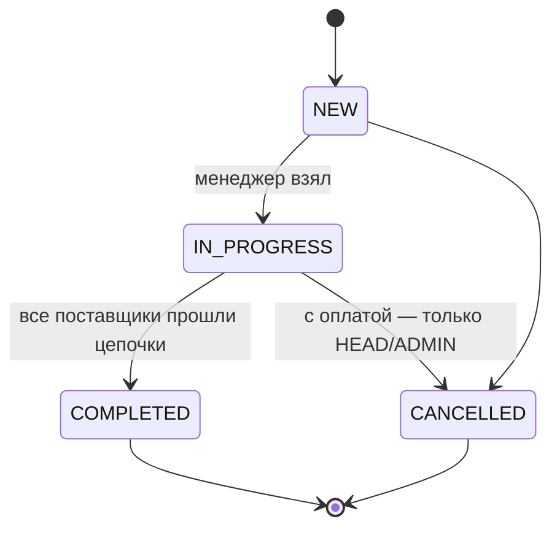
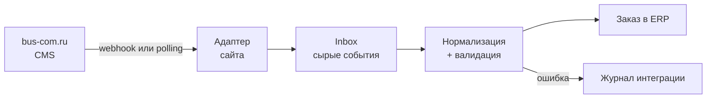

# PRD: BusCom ERP — админка заказов bus-com.ru

> Снимок от 2026-09-20. Живая версия (обсуждение, комментарии): https://claude.ai/code/artifact/527cb091-ee7c-4b47-8fda-47c04c893e89
> При изменении требований обновлять оба места.

## Контекст и проблема

BusCom ERP — внутренняя веб-админка, в которой менеджеры принимают, ведут и закрывают заказы с сайта bus-com.ru от поступления до отгрузки.

[Баском (bus-com.ru)](https://bus-com.ru/) продаёт комплектующие для микроавтобусов: сиденья, люки, полки, поручни, ступени. Сайт принимает заказы, но их обработка (подтверждение, счёт, отгрузка) сейчас идёт вне единой системы — предположительно почта, мессенджеры и таблицы.

Последствия, которые закрывает ERP:

- заказ можно потерять или забыть — нет единой очереди и ответственного;
- статус заказа знает только один менеджер, руководитель видит картину с опозданием;
- нет истории по клиенту и повторных продаж;
- нет цифр: сколько заказов, на какую сумму, где застревают.

Допущение: описание процессов «как есть» сделано без интервью с командой. Проверить на первом созвоне.

## Цели и метрики

MVP считается успешным, когда 100% заказов с сайта обрабатываются в ERP и ни один не висит без ответственного.

| Метрика                                    | Цель MVP                     | Как считаем                              |
| ------------------------------------------ | ---------------------------- | ---------------------------------------- |
| Доля заказов сайта, попавших в ERP         | 100%                         | заказы в ERP / заказы в CMS за неделю    |
| Время до первого касания (в рабочее время) | ≤ 30 мин, медиана            | «Новый» → «В работе» по журналу статусов |
| Заказы без ответственного дольше 1 ч       | 0                            | отчёт «без менеджера»                    |
| Заказы, застрявшие в статусе дольше SLA    | видны на дашборде            | SLA на каждый статус                     |
| Менеджеры работают только в ERP            | через 2 недели после запуска | опрос + активность в журнале             |

**Не входит в MVP (non-goals):**

- замена бухгалтерии и 1С — ERP только выгружает данные;
- складской учёт в любом виде — склада у компании нет, количества товара не ведутся (решение от 2026-09-20);
- управление контентом сайта (страницы, SEO, баннеры);
- личный кабинет клиента и мобильное приложение;
- интеграции с маркетплейсами.

## Пользователи и роли

В MVP три роли; права задаются ролью, а не галочками на пользователе. Роль «Логист/склад» (`WAREHOUSE`) убрана 2026-09-20 вместе со складским блоком.

| Роль                    | Кто                  | Что делает                                                                                                  | Чего не может                                                       |
| ----------------------- | -------------------- | ----------------------------------------------------------------------------------------------------------- | ------------------------------------------------------------------- |
| Менеджер (`MANAGER`)    | продавец             | берёт заказы, связывается с клиентом, правит состав и цены, выставляет счёт, создаёт заказ вручную (звонок) | удалять заказы, давать скидку выше лимита, управлять пользователями |
| Руководитель (`HEAD`)   | владелец / РОП       | всё, что менеджер, + переназначает заказы, видит отчёты и дашборд, отменяет любые заказы                    | настраивать интеграции                                              |
| Администратор (`ADMIN`) | технический владелец | пользователи и роли, справочники (статусы, способы доставки и оплаты), интеграции, аудит-лог                | —                                                                   |

Ожидаемый масштаб: до 10 пользователей и до нескольких сотен заказов в месяц (допущение, уточнить).

## Скоуп MVP

MVP — это девять модулей; критичные для запуска — Заказы, Интеграция и Доступы.

**M1. Заказы (P0)**

1. Список заказов: таблица с фильтрами (статус, менеджер, дата, сумма, источник, оплачен/нет), поиском по номеру, телефону, email, ИНН, сортировкой и пагинацией на сервере.
2. Сохранённые виды: «Мои», «Новые без менеджера», «Просроченные по SLA».
3. Карточка заказа: клиент, позиции, доставка, оплаты, комментарии (внутренние и клиента), лента истории изменений.
4. Редактирование состава: добавить/убрать позицию, количество, цена, скидка на позицию и на заказ; пересчёт итога на сервере.
5. Смена статуса только по разрешённым переходам (см. статусную модель), с обязательной причиной для отмены.
6. Назначение ответственного: «Взять себе» и переназначение руководителем.
7. Ручное создание заказа (источник: телефон, почта, мессенджер).
8. Печатные формы в PDF: счёт на оплату для юрлиц. Комплектовочный лист убран вместе со складом; нужен ли товарный чек — открытый вопрос.

**M2. Клиенты (P1)**

1. Физлица и юрлица (ИНН, КПП, реквизиты), контакты, адреса доставки.
2. Автосопоставление по нормализованному телефону / email при приёме заказа; слияние дублей вручную.
3. История заказов и сумма покупок клиента.
4. Заведение клиента из интерфейса — кнопка «Новый клиент» в списке: клиента можно создать до первого заказа (позвонили, договорились, заказа ещё нет).
5. Реквизиты юрлица для договоров (юр. название и адрес, ОГРН, банк, БИК, р/с, к/с, руководитель, бухгалтер), контактное лицо, паспорт физлица.
6. Импорт клиентской базы из прежней ERP: разовый скрипт, повторный прогон не плодит дублей.
7. Удаление клиента — руководителем или администратором и только если за ним нет заказов.

**M3. Товары (P1)**

1. Каталог, синхронизируемый с сайта: артикул, название, категория (справочник-дерево «раздел → подкатегория», экран `/products/categories`), цена, совместимость (модели авто: ГАЗель, Ford Transit, Mercedes Sprinter и т.п. — уточнить).
2. Позиция заказа хранит снимок названия и цены — правки каталога не меняют старые заказы.
3. Количеств в каталоге нет: склада у компании нет, остаток и резерв не ведутся.
4. Перенос каталога с сайта: `pnpm fetch:site-products` + `pnpm import:site-products`, повторный прогон обновляет товары по сайту, ключ — `product_id` сайта.
5. Опции товара: группы («Ремень», «Выбор стекла») с вариантами и надбавкой к цене; группа может быть обязательной. Правятся в карточке товара, переносятся с сайта. В позиции заказа выбираются при добавлении, цена позиции — базовая плюс надбавки; позиция хранит снимок выбора, опции печатаются в счёте.
6. Картинки товара: пока одна — аватарка (в таблице товаров и в карточке, с заменой и удалением), хранение рассчитано на несколько. Переносятся с сайта (`pnpm import:site-images`).

**M4. Оплаты (P1)**

1. Способы: безнал по счёту, онлайн-оплата на сайте (если есть), наличные / наложенный платёж.
2. Ручная отметка оплаты (сумма, дата, № платёжки); частичная оплата; статус оплаты считается из суммы платежей.

**M5. Доставка (P1)**

1. Самовывоз, ТК (СДЭК, Деловые линии, ПЭК — уточнить), своя доставка по городу.
2. Поля: способ, адрес/терминал, стоимость, габариты и вес груза, трек-номер, дата отгрузки. Интеграция с API ТК — после MVP.

**M6. Уведомления (P2)**

1. Внутренние: Telegram-бот для команды — «новый заказ», «заказ просрочен по SLA».
2. Клиентские: email при смене ключевых статусов (подтверждён, отгружен + трек), шаблоны редактирует админ.

**M7. Дашборд и отчёты (P2)**

1. Заказы и выручка за период, воронка по статусам, средний чек, топ товаров, сравнение менеджеров.
2. Выгрузка любого списка в XLSX/CSV.

**M8. Доступы и администрирование (P0)**

1. Вход по email + паролю, сброс пароля; пользователей заводит админ, саморегистрации нет.
2. Справочники: способы доставки и оплаты, причины отмены, SLA по статусам, **источники заказов** (редактируемый список; «Сайт» и «Прежняя ERP» — системные, их только переименовывают). Источник заказа, заведённого руками, меняется в карточке с записью в журнал.
3. Журнал интеграции: принятые и отклонённые входящие заказы с причиной, кнопка «повторить».

**M9. Поставщики (P1, добавлен 2026-09-21)**

1. Раздел «Поставщики»: список с поиском, карточка, заведение и удаление. Поля — как у клиента: физлицо или юрлицо, телефон, email, ИНН, КПП, контактное лицо, адрес, реквизиты, комментарий. Удаление — руководителем или администратором и только если поставщик не указан в заказах.
2. **Цепочка статусов** в карточке поставщика: свой упорядоченный список этапов работы с ним («Запрошен счёт → Оплачено поставщику → Получено»). Этапы добавляются, переименовываются и переставляются; этап, на котором стоит заказ, убрать нельзя.
3. У товара — список поставщиков, у каждого своя **закупочная** цена. Цена продажи клиенту остаётся в товаре.
4. В позиции заказа выбирается поставщик из поставщиков товара (по умолчанию самый дешёвый); закупочная цена сохраняется снимком, как и цена продажи.
5. В заказе с товарами поставщиков у **каждого поставщика свой трек** по его цепочке — это подстатусы «В работе»; в «Выполнен» заказ уходит, когда все поставщики прошли последний этап. Этапы проходят по порядку, шаг назад разрешён для исправления. Каждая смена этапа пишется в журнал заказа.
6. **Заказ поставщику** (добавлено 2026-09-21). В карточке заказа у каждого поставщика — готовый текст заказа для отправки ему в мессенджер или почтой, с кнопкой «Скопировать». В тексте: номер и дата заказа, только позиции этого поставщика с выбранными опциями, количества и закупочные цены из снимка позиции, итог, доставка и контакты. Артикула нет — у поставщиков свои коды. Шаблон фиксирован в коде и в настройках не правится (docs/DECISIONS.md).

## Бизнес-правила

Правила ниже — значения по умолчанию, выбранные без заказчика; каждое помеченное «уточнить» реализуется как настройка или константа в одном месте, чтобы поменять его без переделки.

| Правило                    | Значение по умолчанию                                                                                                                                                                  | Статус        |
| -------------------------- | -------------------------------------------------------------------------------------------------------------------------------------------------------------------------------------- | ------------- |
| Лимит скидки менеджера     | сумма всех скидок заказа (позиции + заказ) ≤ 10% от суммы товаров до скидок; выше — только HEAD/ADMIN                                                                                  | уточнить %    |
| Когда можно править состав | в NEW и IN_PROGRESS до первой оплаты — менеджер; после оплаты — только HEAD/ADMIN; в COMPLETED/CANCELLED — никто                                                                       | —             |
| Рабочее время для SLA      | пн–пт 09:00–18:00 МСК; праздники РФ — после MVP (производственный календарь)                                                                                                           | уточнить часы |
| SLA считается              | от `statusChangedAt` только по рабочим минутам; просроченный заказ подсвечивается в списке                                                                                             | —             |
| Номер заказа               | своя последовательность ERP с 1; номер с сайта показывается отдельно как «№ на сайте» и ищется тем же поиском                                                                          | —             |
| Статус оплаты              | вычисляемый, не хранится: «Не оплачен» (0), «Частично» (0 < оплачено < итог), «Оплачен» (= итог), «Переплата» (> итог)                                                                 | —             |
| Сопоставление клиента      | сначала по нормализованному телефону, потом по email — но по email только если он ровно у одного клиента; найденного не перезаписываем, новые данные пишем в заказ                     | —             |
| Телефон клиента            | уникален в базе и нормализован (`+7XXXXXXXXXX`), но может быть пустым: у части клиентов телефона нет. Email уникальным не считается — одна почта бухгалтерии бывает на несколько юрлиц | —             |
| Имя клиента                | одно поле: у физлица — ФИО, у юрлица — название. Название компании и контактное лицо не смешиваются: для второго есть своё поле                                                        | —             |
| Изменение цены позиции     | разрешено менеджеру, пишется в журнал со старой и новой ценой; лимит скидки на него не распространяется                                                                                | уточнить      |
| Отмена оплаченного заказа  | если по заказу есть оплата — отменяет только HEAD/ADMIN (нужен возврат денег)                                                                                                          | —             |

## Экраны и критерии приёмки (P0)

Модули P0 считаются готовыми, когда выполнены все критерии ниже; каждый критерий проверяется руками или тестом.

**Карта экранов**

| Маршрут               | Экран                               | Доступ               |
| --------------------- | ----------------------------------- | -------------------- |
| `/login`              | вход                                | все                  |
| `/orders`             | список заказов (стартовая страница) | все роли             |
| `/orders/new`         | ручное создание заказа              | MANAGER, HEAD, ADMIN |
| `/orders/[number]`    | карточка заказа                     | все роли             |
| `/customers`          | список клиентов (M2)                | все роли             |
| `/customers/[id]`     | карточка клиента (M2)               | все роли             |
| `/admin/users`        | пользователи                        | ADMIN                |
| `/admin/dictionaries` | справочники и SLA                   | ADMIN                |
| `/admin/integration`  | журнал интеграции                   | ADMIN, HEAD (чтение) |

Макет: левое меню (Заказы, Клиенты, Товары, Администрирование — по правам), сверху — глобальный поиск заказа и меню пользователя.

**Список заказов `/orders`**

Колонки: №, № на сайте, дата, клиент (имя + телефон), сумма, статус, оплата, менеджер, источник, время в статусе. По умолчанию — новые сверху, 50 на странице.

- [ ] Фильтры по статусу (множественный), менеджеру, источнику, периоду создания, статусу оплаты; фильтры и страница хранятся в URL.
- [ ] Поиск одним полем находит заказ по №, № на сайте, телефону в любом формате, email, ИНН, части имени клиента.
- [ ] Вкладки-виды: «Все», «Мои», «Без менеджера», «Просроченные»; у вкладок — счётчики. Все открывают «Все».
- [ ] Заказ с просроченным SLA подсвечен; удалённые (`deletedAt`) не показываются.
- [ ] На 100 000 заказов страница отвечает ≤ 500 мс (p95) — проверяется на сидах.

**Карточка заказа `/orders/[number]`**

Шапка: №, статус, статус оплаты, менеджер, кнопки доступных переходов. Блоки: клиент · позиции и итоги · доставка · оплаты · комментарий клиента · лента истории с полем внутреннего комментария.

- [ ] Кнопки смены статуса показывают ровно `availableTransitions(статус, роль)`; сервер отклоняет любой другой переход даже при прямом вызове.
- [ ] Отмена открывает диалог с обязательной причиной из справочника + свободный текст.
- [ ] «Взять себе» в NEW назначает менеджера и переводит в IN_PROGRESS одним действием; если заказ уже взял другой — ошибка «заказ уже в работе у …».
- [ ] HEAD/ADMIN могут переназначить менеджера в любом нефинальном статусе.
- [ ] Позиции: добавление из каталога поиском (артикул / название) и произвольной позицией; правка количества, цены, скидки; удаление. Итоги пересчитывает сервер.
- [ ] Превышение лимита скидки менеджером отклоняется сервером с понятной ошибкой.
- [ ] Оплата: форма «способ, сумма (по умолчанию — остаток к оплате), дата, № документа»; статус заказа оплата не меняет — степень оплаты видна бейджем.
- [ ] Доставка: способ, ТК, адрес, стоимость, трек; переход в COMPLETED для CARRIER требует трек-номер.
- [ ] Каждое изменение появляется в ленте: кто, когда, что было → стало.
- [ ] Кнопка «Счёт PDF» скачивает документ с текущими данными (реквизиты продавца — из настроек; уточнить).

**Создание заказа `/orders/new`**

- [ ] Поля: источник, клиент (поиск существующего по телефону / имени / ИНН или новый), позиции, доставка, комментарий.
- [ ] Созданный заказ сразу в IN_PROGRESS с автором в роли менеджера; в журнале — событие CREATED.
- [ ] Телефон нормализуется; при совпадении с существующим клиентом форма предлагает выбрать его.

**Клиенты `/customers` (M2, P1 — сделано сверх этапа 1)**

- [ ] Кнопка «Новый клиент» открывает форму: тип (физлицо / юрлицо), имя или название, телефон, email, ИНН и КПП для юрлица, комментарий. Обязательно только имя.
- [ ] В той же форме заводятся адреса доставки — сколько нужно, один помечается «по умолчанию» (без пометки им становится первый). Адрес хранится одной строкой, отдельного поля «город» нет.
- [ ] У юрлица заполняются контактное лицо и реквизиты для договоров, у физлица — паспорт. Реквизиты дозаполняются в карточке клиента.
- [ ] Телефон нормализуется к `+7XXXXXXXXXX` — так же, как при приёме заказа.
- [ ] Дубль не создаётся: если телефон совпал с существующим клиентом, форма показывает, кто это, и ведёт в его карточку. Телефон уникален в базе, поэтому та же проверка стоит и при правке карточки.
- [ ] После создания открывается карточка нового клиента.
- [ ] Право заводить клиента проверяется на сервере в самом действии, тем же правилом, что и правка карточки (сейчас это все три роли).
- [ ] «Удалить» в карточке спрашивает подтверждение и удаляет клиента вместе с его адресами. Кнопка видна только руководителю и администратору, право проверяется на сервере.
- [ ] Клиента, за которым числится хотя бы один заказ (в том числе удалённый), сервер удалить не даёт и предлагает объединить его с основным.

**Доступы и администрирование (M8)**

- [ ] Без сессии любой маршрут, кроме `/login` и `/api/integrations/*`, редиректит на `/login`.
- [ ] Вход по email + пароль; после 10 неудачных попыток за 15 мин — блокировка входа на 15 мин.
- [ ] Сброс пароля по ссылке на email. Почтовый сервер администратор задаёт в `/admin/dictionaries`, раздел «Почта» (добавлено 2026-09-22); переменные `SMTP_*` остались запасным путём. Не задан нигде — ссылка пишется в лог сервера.
- [ ] Регистрация с формы недоступна; первый ADMIN создаётся скриптом `pnpm db:seed` из env.
- [ ] ADMIN создаёт пользователя (имя, email, роль, временный пароль), меняет роль, деактивирует; деактивированный теряет все сессии сразу. Удалить себя или снять с себя ADMIN нельзя.
- [ ] Справочники: причины отмены, ТК, SLA по статусам (минуты), лимит скидки (%), реквизиты продавца для счёта.
- [ ] Журнал интеграции: список IntegrationInbox с фильтром по статусу, просмотр сырого JSON и ошибки, кнопка «Повторить» для FAILED.
- [ ] Любое действие без прав — 403 на сервере (покрыто тестами на проверку прав).

## Статусная модель заказа

Глобальных статусов четыре (упрощено 2026-09-21); переходы заданы в коде как конечный автомат (`src/domain/order/status.ts`), любой другой переход сервер отклоняет. Промежуточные этапы — счёт, оплата поставщику, отправка — ведутся не глобальными статусами, а в цепочках поставщиков (M9).



| Статус      | Название в UI        | Кто переводит дальше | SLA по умолчанию |
| ----------- | -------------------- | -------------------- | ---------------- |
| NEW         | Создан               | менеджер             | 30 мин           |
| IN_PROGRESS | В работе             | менеджер             | 1 раб. день      |
| COMPLETED   | Выполнен             | —                    | —                |
| CANCELLED   | Отменён (с причиной) | —                    | —                |

**Подстатусы поставщиков (M9).** Пока заказ «В работе», у каждого его поставщика идёт свой трек по цепочке этапов из карточки поставщика. В «Выполнен» сервер пускает, только когда каждый трек стоит на последнем этапе; поставщик без цепочки заказ не держит. В других статусах этапы не меняются.

**Оплата** статус заказа не меняет: степень оплаты считается из суммы платежей и видна бейджем. Отмена заказа, по которому есть оплата, — только руководитель; возвраты как отдельная сущность — после MVP. Для доставки ТК перевод в «Выполнен» требует трек-номер. Каждая смена статуса пишется в журнал: кто, когда, из какого в какой, комментарий.

**Прежние статусы** «Ждёт оплаты», «Оплачен», «Отправка» стали «В работе», «Отгружен» — «Выполнен»; прежние переходы в журнале сохранены текстом в комментарии записи.

## Интеграция с bus-com.ru

Заказы попадают в ERP через один входной шлюз с адаптером под CMS сайта; конкретный адаптер выбираем, когда узнаем, на чём сделан сайт.



Принципы:

- **Сначала сохранить, потом разбирать.** Сырой payload пишется в `IntegrationInbox` до любой обработки — заказ не теряется даже при баге в маппинге.
- **Идемпотентность.** Ключ — `(source, externalId)`; повторная доставка того же заказа не создаёт дубль.
- **Безопасность.** Webhook подписан HMAC-SHA256 общим секретом (`SITE_WEBHOOK_SECRET`); при polling — токен API сайта только на чтение.
- **Направление в MVP — сайт → ERP.** Обратная синхронизация статусов на сайт — этап 4.
- **Каталог** забираем раз в сутки (YML/CommerceML-фид или API), плюс по кнопке.

Варианты адаптера в зависимости от платформы:

| Платформа сайта            | Как забираем заказы                                          | Сложность       |
| -------------------------- | ------------------------------------------------------------ | --------------- |
| 1С-Битрикс                 | REST API или обработчик события `OnSaleOrderSaved` → webhook | низкая          |
| WordPress + WooCommerce    | встроенные webhooks `order.created`                          | низкая          |
| InSales / Tilda / др. SaaS | встроенные webhooks или API заказов                          | низкая          |
| Самопись / нет API         | доработка сайта: POST в ERP при оформлении                   | средняя         |
| Заказы только письмами     | парсинг почтового ящика (IMAP) — временно                    | средняя, хрупко |

Пока адаптера нет, делаем универсальный эндпоинт `POST /api/integrations/site/orders` с фиксированной JSON-схемой заказа (этап 1).

**Контракт входящего заказа (v1)**

`POST /api/integrations/site/orders`, тело — JSON в UTF-8. Заголовок `X-Signature: sha256=<hex>` — HMAC-SHA256 от сырого тела с ключом `SITE_WEBHOOK_SECRET`; сравнение в постоянном времени. Суммы — в копейках.

```json
{
  "externalId": "12345",
  "createdAt": "2026-09-19T10:15:00+03:00",
  "customer": {
    "type": "PERSON",
    "name": "Иван Петров",
    "phone": "+7 912 345-67-89",
    "email": "ivan@example.ru",
    "inn": null,
    "companyName": null
  },
  "items": [
    {
      "externalProductId": "501",
      "sku": "SID-2-GZL",
      "name": "Сиденье двухместное для ГАЗели",
      "priceKopecks": 1250000,
      "quantity": 2
    }
  ],
  "delivery": { "method": "CARRIER", "carrier": "СДЭК", "address": "г. Екатеринбург, …", "priceKopecks": 0 },
  "payment": { "method": "INVOICE", "paidKopecks": 0 },
  "totalKopecks": 2500000,
  "comment": "Перезвоните после 14:00"
}
```

| Ответ | Когда                                                                    | Тело                                         |
| ----- | ------------------------------------------------------------------------ | -------------------------------------------- |
| 201   | заказ создан                                                             | `{ "orderNumber": 1024 }`                    |
| 200   | повтор с тем же `externalId` — ничего не меняется                        | `{ "orderNumber": 1024, "duplicate": true }` |
| 202   | JSON сохранён в inbox, но не прошёл валидацию — разбор вручную в журнале | `{ "inboxId": "…", "error": "…" }`           |
| 401   | нет или неверная подпись; в inbox не пишем                               | —                                            |
| 400   | тело не JSON или нет `externalId` — сохранить нельзя                     | `{ "error": "…" }`                           |

Если `totalKopecks` не совпадает с пересчётом ERP — заказ создаётся, а в журнал пишется предупреждение с обеими суммами. Товар ищется по `externalProductId`, затем по `sku`; не нашли — позиция создаётся без связи с каталогом. Схема фиксируется в коде как Zod-схема; при несовместимых изменениях — новый путь `/v2`.

## Нефункциональные требования

| Область            | Требование                                                                                                        |
| ------------------ | ----------------------------------------------------------------------------------------------------------------- |
| Данные и 152-ФЗ    | ПДн клиентов хранятся на сервере в РФ (Selectel, Timeweb, Yandex Cloud)                                           |
| Доступ             | только HTTPS; сессии в httpOnly-cookie; пароли — argon2/bcrypt; блокировка после 10 неудачных входов              |
| Авторизация        | права проверяются на сервере в каждом action/эндпоинте, UI только скрывает кнопки                                 |
| Аудит              | все изменения заказов, платежей и пользователей — в журнал (кто, когда, до/после); удаление заказов только мягкое |
| Деньги             | суммы в копейках (integer), никаких float; валюта — RUB                                                           |
| Производительность | список заказов ≤ 500 мс (p95) на 100 000 заказов                                                                  |
| Надёжность         | бэкап PostgreSQL ежедневно, хранение 30 дней, вне сервера БД; восстановление проверено до запуска                 |
| Мониторинг         | Sentry (или GlitchTip в РФ) для ошибок; алерт, если за 3 ч рабочего времени не пришло ни одного заказа            |
| UI                 | русский язык; десктоп — основной, карточка заказа удобна с телефона; время — Europe/Moscow                        |
| Качество кода      | строгий TypeScript, линтер, тесты на доменную логику (статусы, итоги, импорт), CI на каждый PR                    |

## Архитектура и стек

Один TypeScript-монолит на Next.js + PostgreSQL: минимум движущихся частей и стек, который AI-агенты знают лучше всего — это важно для вайбкодинга.

| Слой           | Выбор                                                                 | Почему                                              |
| -------------- | --------------------------------------------------------------------- | --------------------------------------------------- |
| Фреймворк      | Next.js (App Router), React, TypeScript strict                        | UI и API в одном деплое, Server Actions для мутаций |
| UI             | Tailwind CSS + shadcn/ui, TanStack Table                              | готовые таблицы/формы для админки                   |
| БД             | PostgreSQL 16 + Prisma ORM                                            | миграции, типы из схемы                             |
| Валидация      | Zod                                                                   | одна схема для форм, action и входящих webhook      |
| Аутентификация | Better Auth (email + пароль, сессии в БД)                             | свои пользователи, без внешнего IdP                 |
| Тесты          | Vitest (домен), Playwright (e2e смоук)                                | быстрый фидбек агенту                               |
| Инфра          | pnpm, Docker Compose (Postgres локально), GitHub Actions CI, VPS в РФ | один сервер справится с объёмом                     |

Слои кода: `app/` (страницы и route handlers) → `server/` (сервисы и права) → `domain/` (чистая логика: статусы, деньги, нормализация) → Prisma. Домен не знает про БД и тестируется без неё.

Модель данных — `prisma/schema.prisma`: User, Customer, CustomerAddress, Product, Order, OrderItem, Payment, OrderEvent, IntegrationInbox (+ служебные таблицы Better Auth).

## Роадмап

До первого рабочего запуска — этапы 0–2, ориентир 4–6 недель при вайбкодинге одним разработчиком.

| Этап                   | Содержание                                                                           | Результат                                            |
| ---------------------- | ------------------------------------------------------------------------------------ | ---------------------------------------------------- |
| 0. Фундамент           | репозиторий, CLAUDE.md, CI, схема БД, вход, сиды                                     | пустая админка с логином                             |
| 1. Заказы              | M1 + M8, универсальный эндпоинт интеграции                                           | заказы ведутся в ERP вручную                         |
| 2. Интеграция и запуск | адаптер сайта, M2–M5, деплой на VPS, бэкапы                                          | заказы с сайта приходят сами; команда работает в ERP |
| 3. Контроль            | M6, M7: Telegram-бот, email клиентам, дашборд, экспорт                               | руководитель видит цифры                             |
| 4. Расширение          | обратная синхронизация с сайтом, API ТК, выгрузка в 1С, возвраты, заказы поставщикам | ERP — единый источник правды                         |

## Открытые вопросы

Первые два вопроса блокируют этап 2; остальные можно закрывать по ходу.

- [ ] На чём сделан bus-com.ru (Битрикс, WordPress, InSales, самопись) и есть ли доступ к его админке / коду?
- [ ] Как сейчас приходит заказ: корзина с оплатой, форма заявки, письмо на почту? Какие поля в форме?
- [ ] Сколько заказов в месяц и сколько человек будут работать в ERP?
- [ ] Доля юрлиц и физлиц; нужны ли счета и УПД из ERP или их делает 1С?
- [ ] Есть ли 1С / МойСклад? (Вопрос «где ведутся остатки» закрыт 2026-09-20: нигде, склада нет.)
- [ ] Какими ТК отгружаете чаще всего?
- [ ] Где хостить: есть ли уже VPS / облако в РФ, домен для админки (например, erp.bus-com.ru)?
