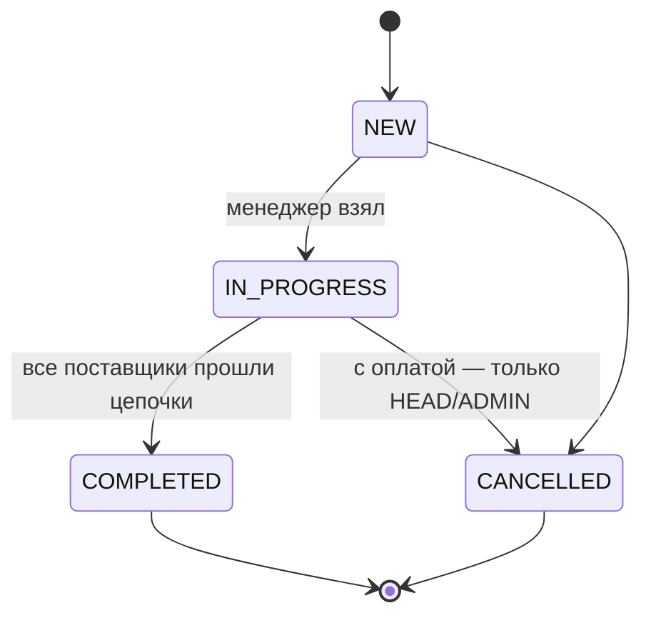
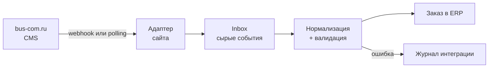

# PRD: BusCom ERP — админка заказов bus-com.ru

> Снимок от 2026-09-24. Живая версия (обсуждение, комментарии): https://claude.ai/code/artifact/527cb091-ee7c-4b47-8fda-47c04c893e89
> При изменении требований обновлять оба места.

## Контекст и проблема

BusCom ERP — внутренняя веб-админка, в которой менеджеры принимают, ведут и закрывают заказы с сайта bus-com.ru от поступления до отгрузки.

[Баском (bus-com.ru)](https://bus-com.ru/) продаёт комплектующие для микроавтобусов: сиденья, люки, полки, поручни, ступени. Сайт принимает заказы, но их обработка (подтверждение, счёт, отгрузка) сейчас идёт вне единой системы — предположительно почта, мессенджеры и таблицы.

Последствия, которые закрывает ERP:

- заказ можно потерять или забыть — нет единой очереди и ответственного;
- статус заказа знает только один менеджер, руководитель видит картину с опозданием;
- нет истории по клиенту и повторных продаж;
- нет цифр: сколько заказов, на какую сумму, где застревают.

Допущение: описание процессов «как есть» сделано без интервью с командой. Проверить на первом созвоне.

## Цели и метрики

MVP считается успешным, когда 100% заказов с сайта обрабатываются в ERP и ни один не висит без ответственного.

| Метрика                                    | Цель MVP                     | Как считаем                              |
| ------------------------------------------ | ---------------------------- | ---------------------------------------- |
| Доля заказов сайта, попавших в ERP         | 100%                         | заказы в ERP / заказы в CMS за неделю    |
| Время до первого касания (в рабочее время) | ≤ 30 мин, медиана            | «Новый» → «В работе» по журналу статусов |
| Заказы без ответственного дольше 1 ч       | 0                            | отчёт «без менеджера»                    |
| Заказы, застрявшие в статусе дольше SLA    | не отслеживается             | SLA выключен (2026-09-24)                |
| Менеджеры работают только в ERP            | через 2 недели после запуска | опрос + активность в журнале             |

**Не входит в MVP (non-goals):**

- замена бухгалтерии — 1С и МойСклад в компании не ведутся (2026-09-24), документы для клиентов ERP печатает сама (M1.8);
- складской учёт в любом виде — склада у компании нет, количества товара не ведутся (решение от 2026-09-20);
- управление контентом сайта (страницы, SEO, баннеры);
- личный кабинет клиента и мобильное приложение;
- интеграции с маркетплейсами.

## Пользователи и роли

В MVP три роли; права задаются ролью, а не галочками на пользователе. Роль «Логист/склад» (`WAREHOUSE`) убрана 2026-09-20 вместе со складским блоком.

| Роль                    | Кто                  | Что делает                                                                                                  | Чего не может                                                       |
| ----------------------- | -------------------- | ----------------------------------------------------------------------------------------------------------- | ------------------------------------------------------------------- |
| Менеджер (`MANAGER`)    | продавец             | берёт заказы, связывается с клиентом, правит состав и цены, выставляет счёт, создаёт заказ вручную (звонок) | удалять заказы, давать скидку выше лимита, управлять пользователями |
| Руководитель (`HEAD`)   | владелец / РОП       | всё, что менеджер, + переназначает заказы, видит отчёты и дашборд, отменяет любые заказы                    | настраивать интеграции                                              |
| Администратор (`ADMIN`) | технический владелец | пользователи и роли, справочники (статусы, способы доставки и оплаты), интеграции, аудит-лог                | —                                                                   |

Кто работает (2026-09-24): два человека на равных правах — владелец (администрирование, связь с поставщиками) и партнёр (работа с клиентами). Отдельная роль «Менеджер» с ограничениями пока не нужна: оба заводятся администраторами. Роль `MANAGER` остаётся в коде для будущих сотрудников.

Масштаб: 2 пользователя, около 50 заказов в месяц. Доля юрлиц и физлиц — примерно поровну.

## Скоуп MVP

MVP — это девять модулей; критичные для запуска — Заказы, Интеграция и Доступы.

**M1. Заказы (P0)**

1. Список заказов: таблица с фильтрами (статус, менеджер, дата, сумма, источник, оплачен/нет), поиском по номеру, телефону, email, ИНН, сортировкой и пагинацией на сервере.
2. Сохранённые виды: «Мои», «Новые без менеджера». Вид «Просроченные по SLA» скрыт вместе с SLA (2026-09-24).
3. Карточка заказа: клиент, позиции, доставка, оплаты, комментарии (внутренние и клиента), лента истории изменений.
4. Редактирование состава: добавить/убрать позицию, количество, цена, скидка на позицию и на заказ; пересчёт итога на сервере.
5. Смена статуса только по разрешённым переходам (см. статусную модель), с обязательной причиной для отмены.
6. Назначение ответственного: «Взять себе» и переназначение руководителем.
7. Ручное создание заказа (источник: телефон, почта, мессенджер).
8. Печатные формы в PDF: счёт на оплату для юрлиц. Комплектовочный лист убран вместе со складом. **УПД и товарный чек** (P1, решено 2026-09-24) — понадобятся после открытия ИП, от лица которого они будут выписываться; реквизиты продавца — из настроек, как у счёта.

**M2. Клиенты (P1)**

1. Физлица и юрлица (ИНН, КПП, реквизиты), контакты, адреса доставки.
2. Автосопоставление по нормализованному телефону / email при приёме заказа; слияние дублей вручную.
3. История заказов и сумма покупок клиента.
4. Заведение клиента из интерфейса — кнопка «Новый клиент» в списке: клиента можно создать до первого заказа (позвонили, договорились, заказа ещё нет).
5. Реквизиты юрлица для договоров (юр. название и адрес, ОГРН, банк, БИК, р/с, к/с, руководитель, бухгалтер), контактное лицо, паспорт физлица.
6. Заполнение юрлица по ИНН — и при заведении, и в карточке: название, КПП, юр. название и адрес, ОГРН, руководитель из ЕГРЮЛ/ЕГРИП. Банковских реквизитов в реестре нет, их вводят руками.
7. Импорт клиентской базы из прежней ERP: разовый скрипт, повторный прогон не плодит дублей.
8. Удаление клиента — руководителем или администратором и только если за ним нет заказов.

**M3. Товары (P1)**

1. Каталог, синхронизируемый с сайта: артикул, название, категория (справочник-дерево «раздел → подкатегория», экран `/products/categories`), цена, совместимость — модели авто. Модели выбираются кнопками из справочника «Модели авто» (M8), сервер принимает только их; у товара хранятся названия. Переименование модели в справочнике меняет её и у товаров; модель, указанную у товаров, удалить нельзя — только выключить. Начальный список взят с сайта поставщика vanproject.ru (2026-09-24):
   - Mercedes Sprinter Classic, Mercedes Sprinter W906, Mercedes Sprinter W907;
   - Volkswagen LT, Volkswagen Crafter W906, Volkswagen Crafter 2017, Volkswagen Transporter T5;
   - Ford Transit 2000–2014, Ford Transit 2015+;
   - Fiat Ducato 244, Fiat Ducato / Peugeot Boxer / Citroen Jumper X250 / X290;
   - Citroen Jumpy / Peugeot Expert 2017+;
   - Iveco Daily 2006–2014, Iveco Daily 2015+;
   - Renault Master III;
   - ГАЗель Бизнес, ГАЗ Соболь, ГАЗ Баргузин, ГАЗель Next, ГАЗель NN, ГАЗель Next CitiLine, ГАЗон Next.
2. Позиция заказа хранит снимок названия и цены — правки каталога не меняют старые заказы.
3. Количеств в каталоге нет: склада у компании нет, остаток и резерв не ведутся.
4. Перенос каталога с сайта: `pnpm fetch:site-products` + `pnpm import:site-products`, повторный прогон обновляет товары по сайту, ключ — `product_id` сайта.
5. Опции товара: группы («Ремень», «Выбор стекла») с вариантами и надбавкой к цене; группа может быть обязательной. Правятся в карточке товара, переносятся с сайта. В позиции заказа выбираются при добавлении, цена позиции — базовая плюс надбавки; позиция хранит снимок выбора, опции печатаются в счёте.
6. Картинки товара: галерея — все картинки со страницы товара на сайте, в том же порядке. Первая — аватарка: её видно в таблице товаров и в позициях заказа. В карточке товара картинки добавляются (можно несколько сразу), назначаются главной и удаляются. Переносятся с сайта (`pnpm import:site-images`), повторный прогон догружает новые и убирает снятые с сайта.
7. Описание товара: переносится с сайта (вкладка «Описание») текстом — абзацы и пункты списков сохраняются, HTML не храним. Видно и правится в карточке товара, уходит в CSV-выгрузку. Повторный прогон `pnpm import:site-products` обновляет описание по сайту.

**M4. Оплаты (P1)**

1. Способы: безнал по счёту, онлайн-оплата на сайте (если есть), наличные / наложенный платёж.
2. Ручная отметка оплаты (сумма, дата, № платёжки); частичная оплата; статус оплаты считается из суммы платежей.

**M5. Доставка (P1)**

1. Самовывоз, ТК (СДЭК, Деловые линии, ПЭК, КИТ (GTD) — подтверждено 2026-09-24), своя доставка по городу.
2. Поля: способ, адрес/терминал, стоимость, габариты и вес груза, трек-номер, дата отгрузки. Интеграция с API ТК — после MVP. Вес вводится в килограммах до граммов, габариты — длина × ширина × высота в целых сантиметрах; всё необязательно. Дата отгрузки правится в карточке, а если пуста — ставится сама при переходе в «Выполнен» (сделано 2026-09-24).

**M6. Уведомления (P2)**

1. Внутренние: письма команде по подпискам в личных настройках (новый заказ, оплата, этапы поставщиков). **Telegram-бот не делаем** (решение владельца, 2026-09-24): большинство клиентов общается в мессенджере Max, команде хватает писем.
2. **Переписка с клиентом по почте** (уточнено 2026-09-24, сделано 2026-09-25). Общий ящик — `info@bus-com.ru`: в него же приходят заказы с сайта. Письмо о заказе с сайта заводит заказ, любое другое ложится в переписку.
   - Входящее привязывается к заказу по цепочке (ответ на наше письмо), по номеру заказа в теме, иначе — только к клиенту по адресу или никуда. Номер в теме — тот, что знает клиент: у заказа с сайта это **номер на сайте** (клиент отвечает на письмо OpenCart «… - Заказ 2828»), у заказа, заведённого руками, — номер в ERP; архивные заказы прежней ERP по номеру не ищутся (их номера пересекаются с номерами сайта). В шаблонах `{номер}` — тот же номер для клиента, `{номер_в_erp}` — внутренний (уточнено 2026-09-25).
   - В ленте процитированная переписка под ответом свёрнута («Показать цитату»).
   - **Импорт истории** (2026-09-25): письма с клиентами за последние 3 года из выбранных папок ящика (по умолчанию все, кроме спама, удалённых и черновиков; «Отправленные» — наши письма). Только письма, где собеседник есть среди клиентов; вложения — названиями, файлы остаются в ящике. Привязка — как у новых писем, плюс достройка цепочек; история сразу прочитана, не ждёт во «Без заказа» и не пишет событий заказа. Запуск, выбор папок и прогресс — в «Настройках почты».
   - В карточке клиента — вся его переписка (свежие сверху), со ссылками на заказы.
   - **Живой ящик в «Почте»** (2026-09-25, только руководитель и администратор): слева — папки ящика, как в Яндексе, с числом писем и непрочитанных; папка и письмо читаются прямо из IMAP, в ERP не копируются. Действия: «Пометить непрочитанным» (открытие письма помечает его прочитанным, как в веб-почте), «Переместить в папку», «Удалить» — перенос в «Удалённые» с подтверждением, окончательное удаление только в самой почте; «Привязать к заказу» — письмо с вложениями ложится в переписку заказа с записью в журнал. Вложения скачиваются прямо из ящика.
   - Номер заказа на сайте — отдельное поле (`siteNumber`): у заказов с сайта — их номер, у архивных — «Номер» прежней ERP. Он показывается в шапке заказа и в списке как «№ на сайте» (раньше там у архивных ошибочно был ID прежней ERP). Непривязанные видны в разделе «Почта» (`/mail`, пункт меню со счётчиком непрочитанных) и привязываются к заказу руками. Вложения входящих хранятся (до 15 МБ на файл, крупнее — отметка «не сохранён»).
   - В карточке заказа — блок «Переписка»: лента писем и форма «Написать клиенту» с шаблонами «Счёт на оплату», «Заказ оплачен», «Заказ отправлен» и галочкой «Приложить счёт PDF». Шаблон заполняется данными заказа, текст правится перед отправкой. Автоматически письма клиенту не уходят: после полной оплаты и после ввода трек-номера карточка предлагает «Сообщить клиенту?» — пока письмо этим шаблоном не отправлено.
   - Шаблоны правит администратор в «Администрирование → Настройки почты» (`/admin/mail`), с подстановками `{номер}`, `{сумма}`, `{трек}`…
   - Каждое отправленное и каждое привязанное письмо пишется в историю заказа.
3. **Переписка в мессенджере Max — после открытия ИП** (решение владельца, 2026-09-25). Только через бота компании по официальному Bot API: личные чаты аккаунта API не читает, неофициальные клиенты нарушают правила Max. Бота заводят юрлицо, ИП или самозанятый — резидент РФ, после верификации профиля на платформе Max для партнёров и модерации бота. Замысел: клиент пишет боту, бот просит «Поделиться контактом», по телефону ERP находит клиента; сообщения ложатся в ту же ленту «Переписка» и раздел «Почта» (станет «Сообщения») с пометкой канала; ответ из карточки заказа с выбором канала, те же шаблоны, счёт PDF файлом. Ограничения: бот пишет только тем, кто начал с ним диалог; старые личные переписки не переносятся.

**M7. Дашборд и отчёты (P2)**

1. Экран «Аналитика» (`/analytics`, руководитель и администратор; сделан 2026-09-24): период — пресеты и даты «с — по». Выручка — выполненные заказы по дате выполнения, средний чек, маржа по заказам, где она известна («посчитана по N из M»), поступившие оплаты по дате платежа; график выручки по дням или месяцам; заказы, созданные в периоде, по статусам со ссылкой в список; топ-10 товаров. Сравнение менеджеров не нужно (решение владельца, 2026-09-24).
2. Выгрузка любого списка в CSV (открывается в Excel). XLSX не нужен — CSV хватает (решение владельца, 2026-09-24).

**M8. Доступы и администрирование (P0)**

1. Вход по email + паролю, сброс пароля; пользователей заводит админ, саморегистрации нет.
2. Справочники: способы доставки и оплаты, причины отмены, модели авто (M3), SLA по статусам (скрыт, пока SLA выключен), **источники заказов** (редактируемый список; «Сайт» и «Прежняя ERP» — системные, их только переименовывают). Источник заказа, заведённого руками, меняется в карточке с записью в журнал.
3. Журнал интеграции: принятые и отклонённые входящие заказы с причиной, кнопка «повторить».

**M9. Поставщики (P1, добавлен 2026-09-21)**

1. Раздел «Поставщики»: список с поиском, карточка, заведение и удаление. Поля — как у клиента: физлицо или юрлицо, телефон, email, ИНН, КПП, контактное лицо, адрес, реквизиты, комментарий. Удаление — руководителем или администратором и только если поставщик не указан в заказах.
2. **Цепочка статусов** в карточке поставщика: свой упорядоченный список этапов работы с ним («Запрошен счёт → Оплачено поставщику → Получено»). Этапы добавляются, переименовываются и переставляются; этап, на котором стоит заказ, убрать нельзя.
3. У товара — список поставщиков, у каждого своя **закупочная** цена. Цена продажи клиенту остаётся в товаре. Кнопка «Подтянуть цену» берёт закупку со страницы товара у поставщика (avito.ru, vanproject.ru). Если цена там зависит от вариантов (vanproject.ru: выпадающие списки), в карточке товара появляются те же списки; цена подтягивается для выбранного варианта, выбор запоминается вместе со ссылкой (добавлено 2026-09-23). У вариантов опций товара — своя закупка у каждого поставщика («Закупка по опциям»): закупка позиции в заказе — базовая закупка плюс закупки выбранных вариантов, как цена продажи — цена товара плюс надбавки. Кнопка «Подтянуть цены опций» обходит все варианты на странице поставщика и сопоставляет их с нашими по размеру, стороне и форточке: однозначные заполняются сами, неоднозначные (тонировка, петли) — выбор из кандидатов с ценами (добавлено 2026-09-23).
4. В позиции заказа выбирается поставщик из поставщиков товара (по умолчанию самый дешёвый); закупочная цена сохраняется снимком, как и цена продажи.
5. В заказе с товарами поставщиков у **каждого поставщика свой трек** по его цепочке — это подстатусы «В работе»; в «Выполнен» заказ уходит, когда все поставщики прошли последний этап. Этапы проходят по порядку, шаг назад разрешён для исправления. Каждая смена этапа пишется в журнал заказа.
6. **Заказ поставщику** (добавлено 2026-09-21, дополнено 2026-09-22). В карточке заказа у каждого поставщика — готовый текст заказа для отправки ему в мессенджер или почтой, с кнопкой «Скопировать». В тексте: номер и дата заказа, только позиции этого поставщика с выбранными опциями, количества и закупочные цены из снимка позиции, итог, доставка и полные реквизиты клиента-покупателя (юр. название, ИНН/КПП, юр. адрес, ОГРН, банк, телефон — не нашей компании: поставщик выписывает документы и получает оплату на юрлицо клиента). Артикула нет — у поставщиков свои коды. Шаблон фиксирован в коде и в настройках не правится (docs/DECISIONS.md).
7. **Действия и артефакты** (добавлено 2026-09-22). В карточке поставщика — раздел с чекбоксами: какие функции у него включены. Список функций фиксирован в коде (`src/domain/supplier/actions.ts`), у каждой — своё описание. Включённая функция появляется у поставщика в карточке заказа как кнопка или загрузчик файла; выключенная — не появляется. Сейчас в списке: «Заказ поставщику» (см. пункт 6 выше, стала опциональной — по умолчанию включена у всех, чтобы уже заведённые поставщики не потеряли то, что у них и так было) и «Прикрепить счёт поставщика клиенту» — загрузчик PDF или фото счёта (до 15 МБ), файл привязан к паре заказ–поставщик и виден только тем, у кого есть доступ к заказу. Каждое прикрепление, замена и удаление файла пишутся в журнал заказа.
8. **Экономика цены** (добавлено 2026-09-23). В карточке поставщика — конструктор формулы: во что нам обходится его товар. Номинал — закупочная цена из карточки товара (её видит поставщик в «Заказе поставщику»). К ней по порядку применяются шаги: процент (у каждого своя база — от номинала или от накопленной суммы; отрицательный — скидка поставщика), фиксированная сумма за штуку, округление (вверх / до ближайших / вниз, до заданной кратности). Отдельно — расходы на заказ: фиксированные суммы, которые добавляются один раз к заказу у этого поставщика, сколько бы штук ни было. Надбавки по проценту, комиссия с прибыли и доля скидки на заказ округляются до целых рублей, половина — в нашу пользу: надбавка и комиссия вниз, скидка поставщика и доля скидки на заказ — вверх по модулю (добавлено 2026-09-23). Под формулой — проверка на любой цене с расшифровкой по шагам. Формула одна на поставщика. Стоимость для нас видна в таблице товаров поставщика, в списке и карточке товара, при выборе поставщика в позиции заказа. В заказ она попадает снимком (за штуку — в позиции, расходы на заказ — у поставщика в заказе): правка формулы старые заказы не меняет. В карточке заказа — **маржа**: товары со скидками минус закупка для нас и расходы на заказ; доставка клиенту не учитывается (транзитная). Если у позиции не выбран поставщик, маржа не считается — показывается, сколько позиций мешают.
9. **Комиссия с прибыли** (добавлено 2026-09-23). В карточке поставщика — раздел с одним процентом: какую долю нашей прибыли по его товарам в заказе удерживает поставщик (0 — не удерживает). Прибыль считается по всем товарам этого поставщика в заказе: продажа минус стоимость для нас (с «Экономикой цены»), минус его расходы на заказ, минус его доля скидки на заказ (скидка раскладывается пропорционально сумме товаров). Убыточная позиция уменьшает базу; итог меньше нуля — комиссия 0. Под процентом — проверка на примере. Процент попадает в заказ снимком у поставщика заказа; комиссия вычитается из маржи и показывается в её блоке отдельной строкой по каждому поставщику.

## Бизнес-правила

Правила ниже — значения по умолчанию, выбранные без заказчика; каждое помеченное «уточнить» реализуется как настройка или константа в одном месте, чтобы поменять его без переделки.

| Правило                    | Значение по умолчанию                                                                                                                                                                                                                                                                                                                                                                     | Статус |
| -------------------------- | ----------------------------------------------------------------------------------------------------------------------------------------------------------------------------------------------------------------------------------------------------------------------------------------------------------------------------------------------------------------------------------------- | ------ |
| Лимит скидки менеджера     | сумма всех скидок заказа (позиции + заказ) ≤ 10% от суммы товаров до скидок; выше — только HEAD/ADMIN. Пока роли «Менеджер» нет в работе, лимит ни на кого не действует                                                                                                                                                                                                                   | —      |
| Когда можно править состав | в NEW и IN_PROGRESS до первой оплаты — менеджер; после оплаты — только HEAD/ADMIN; в COMPLETED/CANCELLED — никто                                                                                                                                                                                                                                                                          | —      |
| Рабочее время для SLA      | пн–пт 09:00–18:00 МСК; праздники РФ — после MVP (производственный календарь). По нему же считается колонка «В статусе» в списке                                                                                                                                                                                                                                                           | —      |
| SLA считается              | выключен (2026-09-24, флаг `SLA_ENABLED`). При включении — от `statusChangedAt` только по рабочим минутам; просроченный заказ подсвечивается в списке                                                                                                                                                                                                                                     | —      |
| Номер заказа               | своя последовательность ERP с 1; номер с сайта показывается отдельно как «№ на сайте» и ищется тем же поиском                                                                                                                                                                                                                                                                             | —      |
| Статус оплаты              | вычисляемый, не хранится: «Не оплачен» (0), «Частично» (0 < оплачено < итог), «Оплачен» (= итог), «Переплата» (> итог)                                                                                                                                                                                                                                                                    | —      |
| Сопоставление клиента      | заказ с ИНН — только по ИНН (среди нескольких клиентов с одним ИНН — по КПП, затем по телефону/email, иначе самый давний); нет такого — новое юрлицо, а занятый другим клиентом телефон пишется ему в комментарий (изменено 2026-09-23). Без ИНН — по нормализованному телефону, потом по email, если он ровно у одного клиента. Найденного не перезаписываем, новые данные пишем в заказ | —      |
| Телефон клиента            | уникален в базе и нормализован (`+7XXXXXXXXXX`), но может быть пустым: у части клиентов телефона нет. Email уникальным не считается — одна почта бухгалтерии бывает на несколько юрлиц                                                                                                                                                                                                    | —      |
| Имя клиента                | одно поле: у физлица — ФИО, у юрлица — название. Название компании и контактное лицо не смешиваются: для второго есть своё поле                                                                                                                                                                                                                                                           | —      |
| Изменение цены позиции     | разрешено менеджеру, пишется в журнал со старой и новой ценой; лимит скидки на него не распространяется (подтверждено 2026-09-24)                                                                                                                                                                                                                                                         | —      |
| Отмена оплаченного заказа  | если по заказу есть оплата — отменяет только HEAD/ADMIN (нужен возврат денег)                                                                                                                                                                                                                                                                                                             | —      |

## Экраны и критерии приёмки (P0)

Модули P0 считаются готовыми, когда выполнены все критерии ниже; каждый критерий проверяется руками или тестом.

**Карта экранов**

| Маршрут               | Экран                                | Доступ               |
| --------------------- | ------------------------------------ | -------------------- |
| `/login`              | вход                                 | все                  |
| `/orders`             | список заказов (стартовая страница)  | все роли             |
| `/orders/new`         | ручное создание заказа               | MANAGER, HEAD, ADMIN |
| `/orders/[number]`    | карточка заказа                      | все роли             |
| `/customers`          | список клиентов (M2)                 | все роли             |
| `/customers/[id]`     | карточка клиента (M2)                | все роли             |
| `/admin/users`        | пользователи                         | ADMIN                |
| `/admin/dictionaries` | справочники и настройки              | ADMIN                |
| `/admin/integration`  | журнал интеграции                    | ADMIN, HEAD (чтение) |
| `/admin/mail`         | настройки почты: SMTP, IMAP, шаблоны | ADMIN                |
| `/analytics`          | аналитика (M7)                       | HEAD, ADMIN          |
| `/mail`, `/mail/[id]` | почта: переписка с клиентами (M6)    | все роли             |

Макет: левое меню (Заказы, Клиенты, Товары, Администрирование — по правам), сверху — глобальный поиск заказа и меню пользователя.

**Список заказов `/orders`**

Колонки: №, № на сайте, дата, клиент (имя + телефон), сумма, статус, оплата, позиции (компактно), текущий этап по каждому поставщику, время в статусе. По умолчанию — новые сверху, 50 на странице.

- [ ] Фильтры по статусу (множественный), менеджеру, источнику, периоду создания, статусу оплаты; фильтры и страница хранятся в URL.
- [ ] Поиск одним полем находит заказ по №, № на сайте, телефону в любом формате, email, ИНН, части имени клиента.
- [ ] Вкладки-виды: «Все», «Мои», «Без менеджера» («Просроченные» — только при включённом SLA); у вкладок — счётчики. Все открывают «Все».
- [ ] Удалённые (`deletedAt`) не показываются.
- [ ] На 100 000 заказов страница отвечает ≤ 500 мс (p95) — проверяется на сидах.

**Карточка заказа `/orders/[number]`**

Шапка: №, статус, статус оплаты, менеджер, кнопки доступных переходов. Блоки: клиент · позиции и итоги · доставка · оплаты · комментарий клиента · лента истории с полем внутреннего комментария.

- [ ] Кнопки смены статуса показывают ровно `availableTransitions(статус, роль)`; сервер отклоняет любой другой переход даже при прямом вызове.
- [ ] Отмена открывает диалог с обязательной причиной из справочника + свободный текст.
- [ ] «Взять себе» в NEW назначает менеджера и переводит в IN_PROGRESS одним действием; если заказ уже взял другой — ошибка «заказ уже в работе у …».
- [ ] HEAD/ADMIN могут переназначить менеджера в любом нефинальном статусе.
- [ ] Позиции: добавление из каталога поиском (артикул / название) и произвольной позицией; правка количества, цены, скидки; удаление. Итоги пересчитывает сервер.
- [ ] Превышение лимита скидки менеджером отклоняется сервером с понятной ошибкой.
- [ ] Оплата: форма «способ, сумма (по умолчанию — остаток к оплате), дата, № документа»; статус заказа оплата не меняет — степень оплаты видна бейджем.
- [ ] Доставка: способ, ТК, адрес, стоимость, трек; переход в COMPLETED для CARRIER требует трек-номер.
- [ ] Каждое изменение появляется в ленте: кто, когда, что было → стало.
- [ ] Кнопка «Счёт PDF» скачивает документ с текущими данными (реквизиты продавца — из настроек).

**Создание заказа `/orders/new`**

- [ ] Поля: источник, клиент (поиск существующего по телефону / имени / ИНН или новый), позиции, доставка, комментарий.
- [ ] Созданный заказ сразу в IN_PROGRESS с автором в роли менеджера; в журнале — событие CREATED.
- [ ] Телефон нормализуется; при совпадении с существующим клиентом форма предлагает выбрать его.

**Клиенты `/customers` (M2, P1 — сделано сверх этапа 1)**

- [ ] Кнопка «Новый клиент» открывает форму: тип (физлицо / юрлицо), имя или название, телефон, email, ИНН и КПП для юрлица, комментарий. Обязательно только имя.
- [ ] В той же форме заводятся адреса доставки — сколько нужно, один помечается «по умолчанию» (без пометки им становится первый). Адрес хранится одной строкой, отдельного поля «город» нет.
- [ ] У юрлица заполняются контактное лицо и реквизиты для договоров, у физлица — паспорт. Реквизиты дозаполняются в карточке клиента.
- [ ] Кнопка «Заполнить» у поля ИНН (и Enter в нём) — в форме заведения и в карточке — подставляет из ЕГРЮЛ/ЕГРИП КПП, юр. название и адрес, ОГРН, руководителя; рабочее название — только если оно пустое. Ничего не сохраняет сама. Опечатка в ИНН ловится по контрольной цифре до запроса; ликвидированная или банкротная организация — предупреждение. Банк не трогается.
- [ ] Телефон нормализуется к `+7XXXXXXXXXX` — так же, как при приёме заказа.
- [ ] Дубль не создаётся: если телефон совпал с существующим клиентом, форма показывает, кто это, и ведёт в его карточку. Телефон уникален в базе, поэтому та же проверка стоит и при правке карточки.
- [ ] После создания открывается карточка нового клиента.
- [ ] Право заводить клиента проверяется на сервере в самом действии, тем же правилом, что и правка карточки (сейчас это все три роли).
- [ ] «Удалить» в карточке спрашивает подтверждение и удаляет клиента вместе с его адресами. Кнопка видна только руководителю и администратору, право проверяется на сервере.
- [ ] Клиента, за которым числится хотя бы один заказ (в том числе удалённый), сервер удалить не даёт и предлагает объединить его с основным.

**Доступы и администрирование (M8)**

- [ ] Без сессии любой маршрут, кроме `/login` и `/api/integrations/*`, редиректит на `/login`.
- [ ] Вход по email + пароль; после 10 неудачных попыток за 15 мин — блокировка входа на 15 мин.
- [ ] Сброс пароля по ссылке на email. Почтовый сервер администратор задаёт в `/admin/mail` «Настройки почты» (добавлено 2026-09-22, отдельный раздел — 2026-09-25); переменные `SMTP_*` остались запасным путём. Там же — входящая почта (IMAP, общий ящик; `IMAP_*` — запасной путь) и шаблоны писем клиенту. Не задан нигде — ссылка пишется в лог сервера.
- [ ] Регистрация с формы недоступна; первый ADMIN создаётся скриптом `pnpm db:seed` из env.
- [ ] ADMIN создаёт пользователя (имя, email, роль, временный пароль), меняет роль, деактивирует; деактивированный теряет все сессии сразу. Удалить себя или снять с себя ADMIN нельзя.
- [ ] Справочники: причины отмены, ТК, лимит скидки (%), реквизиты продавца для счёта. SLA по статусам — только при включённом SLA.
- [ ] Журнал интеграции: список IntegrationInbox с фильтром по статусу, просмотр сырого JSON и ошибки, кнопка «Повторить» для FAILED.
- [ ] Любое действие без прав — 403 на сервере (покрыто тестами на проверку прав).

## Статусная модель заказа

Глобальных статусов четыре (упрощено 2026-09-21); переходы заданы в коде как конечный автомат (`src/domain/order/status.ts`), любой другой переход сервер отклоняет. Промежуточные этапы — счёт, оплата поставщику, отправка — ведутся не глобальными статусами, а в цепочках поставщиков (M9).



SLA выключен (2026-09-24); нормативы в таблице — на случай, если его включат обратно.

| Статус      | Название в UI        | Кто переводит дальше | SLA по умолчанию |
| ----------- | -------------------- | -------------------- | ---------------- |
| NEW         | Создан               | менеджер             | 30 мин           |
| IN_PROGRESS | В работе             | менеджер             | 1 раб. день      |
| COMPLETED   | Выполнен             | —                    | —                |
| CANCELLED   | Отменён (с причиной) | —                    | —                |

**Подстатусы поставщиков (M9).** Пока заказ «В работе», у каждого его поставщика идёт свой трек по цепочке этапов из карточки поставщика. В «Выполнен» сервер пускает, только когда каждый трек стоит на последнем этапе; поставщик без цепочки заказ не держит. В других статусах этапы не меняются.

**Оплата** статус заказа не меняет: степень оплаты считается из суммы платежей и видна бейджем. Отмена заказа, по которому есть оплата, — только руководитель; возвраты как отдельная сущность — после MVP. Для доставки ТК перевод в «Выполнен» требует трек-номер. Каждая смена статуса пишется в журнал: кто, когда, из какого в какой, комментарий.

**Прежние статусы** «Ждёт оплаты», «Оплачен», «Отправка» стали «В работе», «Отгружен» — «Выполнен»; прежние переходы в журнале сохранены текстом в комментарии записи.

## Интеграция с bus-com.ru

Заказы попадают в ERP через один входной шлюз с адаптером под CMS сайта; конкретный адаптер выбираем, когда узнаем, на чём сделан сайт.



Принципы:

- **Сначала сохранить, потом разбирать.** Сырой payload пишется в `IntegrationInbox` до любой обработки — заказ не теряется даже при баге в маппинге.
- **Идемпотентность.** Ключ — `(source, externalId)`; повторная доставка того же заказа не создаёт дубль.
- **Безопасность.** Webhook подписан HMAC-SHA256 общим секретом (`SITE_WEBHOOK_SECRET`); при polling — токен API сайта только на чтение.
- **Направление в MVP — сайт → ERP.** Обратная синхронизация статусов на сайт — этап 4.
- **Каталог** забираем раз в сутки (YML/CommerceML-фид или API), плюс по кнопке.

Варианты адаптера в зависимости от платформы:

| Платформа сайта            | Как забираем заказы                                          | Сложность       |
| -------------------------- | ------------------------------------------------------------ | --------------- |
| 1С-Битрикс                 | REST API или обработчик события `OnSaleOrderSaved` → webhook | низкая          |
| WordPress + WooCommerce    | встроенные webhooks `order.created`                          | низкая          |
| InSales / Tilda / др. SaaS | встроенные webhooks или API заказов                          | низкая          |
| Самопись / нет API         | доработка сайта: POST в ERP при оформлении                   | средняя         |
| Заказы только письмами     | парсинг почтового ящика (IMAP) — временно                    | средняя, хрупко |

Пока адаптера нет, делаем универсальный эндпоинт `POST /api/integrations/site/orders` с фиксированной JSON-схемой заказа (этап 1).

**Сейчас работает адаптер писем** (добавлено 2026-09-23). Сайт сделан на OpenCart и шлёт уведомление «Вы получили заказ» на ящик `zakaz@erp.bus-com.ru` (хостинг Джино). ERP забирает письма по IMAP раз в 2 минуты, в журнал интеграции кладёт письмо целиком (источник «Сайт (письмо)»), разбирает его в контракт v1 ниже и создаёт заказ тем же путём, что и эндпоинт. Берутся только письма, пришедшие после подключения ящика; принятое письмо отмечается прочитанным; повторное чтение того же письма дубля не создаёт — ключ по номеру заказа на сайте. Позиции сопоставляются с каталогом по «Модели» (`Product.sku`). Реквизиты юрлица покупатели пишут в комментарий: ИНН с верной контрольной суммой делает клиента юрлицом, КПП выбирает филиал. Способ оплаты с сайта пишется в первую запись журнала заказа. Разбор — `src/domain/integration/site-email.ts`, опрос — `src/server/integrations/mailbox.ts`.

**Контракт входящего заказа (v1)**

`POST /api/integrations/site/orders`, тело — JSON в UTF-8. Заголовок `X-Signature: sha256=<hex>` — HMAC-SHA256 от сырого тела с ключом `SITE_WEBHOOK_SECRET`; сравнение в постоянном времени. Суммы — в копейках.

```json
{
  "externalId": "12345",
  "createdAt": "2026-09-19T10:15:00+03:00",
  "customer": {
    "type": "PERSON",
    "name": "Иван Петров",
    "phone": "+7 912 345-67-89",
    "email": "ivan@example.ru",
    "inn": null,
    "kpp": null,
    "companyName": null
  },
  "items": [
    {
      "externalProductId": "501",
      "sku": "SID-2-GZL",
      "name": "Сиденье двухместное для ГАЗели",
      "priceKopecks": 1250000,
      "quantity": 2
    }
  ],
  "delivery": { "method": "CARRIER", "carrier": "СДЭК", "address": "г. Екатеринбург, …", "priceKopecks": 0 },
  "payment": { "method": "INVOICE", "paidKopecks": 0 },
  "totalKopecks": 2500000,
  "comment": "Перезвоните после 14:00"
}
```

| Ответ | Когда                                                                    | Тело                                         |
| ----- | ------------------------------------------------------------------------ | -------------------------------------------- |
| 201   | заказ создан                                                             | `{ "orderNumber": 1024 }`                    |
| 200   | повтор с тем же `externalId` — ничего не меняется                        | `{ "orderNumber": 1024, "duplicate": true }` |
| 202   | JSON сохранён в inbox, но не прошёл валидацию — разбор вручную в журнале | `{ "inboxId": "…", "error": "…" }`           |
| 401   | нет или неверная подпись; в inbox не пишем                               | —                                            |
| 400   | тело не JSON или нет `externalId` — сохранить нельзя                     | `{ "error": "…" }`                           |

Если `totalKopecks` не совпадает с пересчётом ERP — заказ создаётся, а в журнал пишется предупреждение с обеими суммами. Товар ищется по `externalProductId`, затем по `sku`; не нашли — позиция создаётся без связи с каталогом. Схема фиксируется в коде как Zod-схема; при несовместимых изменениях — новый путь `/v2`.

## Нефункциональные требования

| Область            | Требование                                                                                                                                           |
| ------------------ | ---------------------------------------------------------------------------------------------------------------------------------------------------- |
| Данные и 152-ФЗ    | ПДн клиентов хранятся на сервере в РФ (Selectel, Timeweb, Yandex Cloud)                                                                              |
| Доступ             | только HTTPS; сессии в httpOnly-cookie; пароли — argon2/bcrypt; блокировка после 10 неудачных входов                                                 |
| Авторизация        | права проверяются на сервере в каждом action/эндпоинте, UI только скрывает кнопки                                                                    |
| Аудит              | все изменения заказов, платежей и пользователей — в журнал (кто, когда, до/после); удаление заказов только мягкое                                    |
| Деньги             | суммы в копейках (integer), никаких float; валюта — RUB                                                                                              |
| Производительность | список заказов ≤ 500 мс (p95) на 100 000 заказов                                                                                                     |
| Надёжность         | бэкап PostgreSQL ежедневно, хранение 30 дней, копия вне сервера БД (на машине владельца, 2026-09-24); восстановление проверено до запуска            |
| Мониторинг         | не нужен (решение владельца 2026-09-24): два пользователя сами видят ошибки, а алерт «нет заказов 3 ч» при ~50 заказах в месяц срабатывал бы впустую |
| UI                 | русский язык; десктоп — основной, карточка заказа удобна с телефона; время — Europe/Moscow                                                           |
| Качество кода      | строгий TypeScript, линтер, тесты на доменную логику (статусы, итоги, импорт), CI на каждый PR                                                       |

## Архитектура и стек

Один TypeScript-монолит на Next.js + PostgreSQL: минимум движущихся частей и стек, который AI-агенты знают лучше всего — это важно для вайбкодинга.

| Слой           | Выбор                                                                 | Почему                                              |
| -------------- | --------------------------------------------------------------------- | --------------------------------------------------- |
| Фреймворк      | Next.js (App Router), React, TypeScript strict                        | UI и API в одном деплое, Server Actions для мутаций |
| UI             | Tailwind CSS + shadcn/ui, TanStack Table                              | готовые таблицы/формы для админки                   |
| БД             | PostgreSQL 16 + Prisma ORM                                            | миграции, типы из схемы                             |
| Валидация      | Zod                                                                   | одна схема для форм, action и входящих webhook      |
| Аутентификация | Better Auth (email + пароль, сессии в БД)                             | свои пользователи, без внешнего IdP                 |
| Тесты          | Vitest (домен), Playwright (e2e смоук)                                | быстрый фидбек агенту                               |
| Инфра          | pnpm, Docker Compose (Postgres локально), GitHub Actions CI, VPS в РФ | один сервер справится с объёмом                     |

Слои кода: `app/` (страницы и route handlers) → `server/` (сервисы и права) → `domain/` (чистая логика: статусы, деньги, нормализация) → Prisma. Домен не знает про БД и тестируется без неё.

Модель данных — `prisma/schema.prisma`: User, Customer, CustomerAddress, Product, Order, OrderItem, Payment, OrderEvent, IntegrationInbox (+ служебные таблицы Better Auth).

## Роадмап

До первого рабочего запуска — этапы 0–2, ориентир 4–6 недель при вайбкодинге одним разработчиком.

| Этап                   | Содержание                                                                     | Результат                                            |
| ---------------------- | ------------------------------------------------------------------------------ | ---------------------------------------------------- |
| 0. Фундамент           | репозиторий, CLAUDE.md, CI, схема БД, вход, сиды                               | пустая админка с логином                             |
| 1. Заказы              | M1 + M8, универсальный эндпоинт интеграции                                     | заказы ведутся в ERP вручную                         |
| 2. Интеграция и запуск | адаптер сайта, M2–M5, деплой на VPS, бэкапы                                    | заказы с сайта приходят сами; команда работает в ERP |
| 3. Контроль            | M6, M7: письма команде, переписка с клиентом, дашборд, экспорт                 | руководитель видит цифры                             |
| 4. Расширение          | обратная синхронизация с сайтом, API ТК, УПД и товарный чек, бот Max, возвраты | ERP — единый источник правды                         |

## Открытые вопросы

Открытых вопросов нет (2026-09-24).

- [x] Нужен ли SLA — нет (закрыто 2026-09-24): подсветка просрочки, вид «Просроченные» и нормативы скрыты флагом `SLA_ENABLED`, см. `docs/DECISIONS.md`.
- [x] На чём сделан bus-com.ru — **OpenCart** (закрыто 2026-09-23 по письму-уведомлению о заказе). Доступ к админке и коду есть (2026-09-24).
- [x] Как сейчас приходит заказ — корзина сайта, уведомление письмом на почту (закрыто 2026-09-23). Поля: email, телефон, адреса оплаты и доставки, способы оплаты и доставки, позиции с «Моделью», комментарий; отдельных полей для реквизитов юрлица нет. Заказы принимаются из писем, см. «Интеграция с bus-com.ru».
- [x] Сколько заказов и людей — около 50 заказов в месяц, 2 человека на равных правах (закрыто 2026-09-24, см. «Пользователи и роли»).
- [x] Доля юрлиц и физлиц — примерно поровну; документы (счёт, УПД, товарный чек) делает ERP (закрыто 2026-09-24).
- [x] 1С / МойСклад — ни того, ни другого (закрыто 2026-09-24). Остатки нигде не ведутся, склада нет (2026-09-20).
- [x] Какие ТК — СДЭК, Деловые линии, ПЭК, КИТ (GTD) (закрыто 2026-09-24).
- [x] Где хостить — **Джино.VPS**, админка на `erp.bus-com.ru` (закрыто 2026-09-20, подробности — `docs/DEPLOY.md`).
- [x] Незакрытые заказы из архива прежней ERP — уже перенесены, вопрос снят (2026-09-24).
- [x] Лимит скидки и правка цены менеджером — лимит пока ни на кого не действует, правка цены без лимита подтверждена (2026-09-24).
- [x] Реквизиты продавца для счёта — из настроек, подтверждено (2026-09-24).
- [x] Модели авто для совместимости — список с vanproject.ru, см. M3 (2026-09-24).
