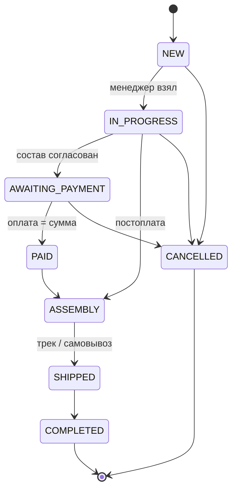
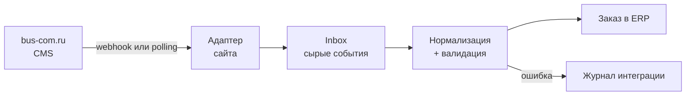

# PRD: BusCom ERP — админка заказов bus-com.ru

> Снимок от 2026-09-19. Живая версия (обсуждение, комментарии): https://claude.ai/code/artifact/527cb091-ee7c-4b47-8fda-47c04c893e89
> При изменении требований обновлять оба места.

## Контекст и проблема

BusCom ERP — внутренняя веб-админка, в которой менеджеры принимают, ведут и закрывают заказы с сайта bus-com.ru от поступления до отгрузки.

[Баском (bus-com.ru)](https://bus-com.ru/) продаёт комплектующие для микроавтобусов: сиденья, люки, полки, поручни, ступени. Сайт принимает заказы, но их обработка (подтверждение, резерв, счёт, отгрузка) сейчас идёт вне единой системы — предположительно почта, мессенджеры и таблицы.

Последствия, которые закрывает ERP:

- заказ можно потерять или забыть — нет единой очереди и ответственного;
- статус заказа знает только один менеджер, руководитель видит картину с опозданием;
- нет истории по клиенту и повторных продаж;
- нет цифр: сколько заказов, на какую сумму, где застревают.

Допущение: описание процессов «как есть» сделано без интервью с командой. Проверить на первом созвоне.

## Цели и метрики

MVP считается успешным, когда 100% заказов с сайта обрабатываются в ERP и ни один не висит без ответственного.

| Метрика                                    | Цель MVP                     | Как считаем                              |
| ------------------------------------------ | ---------------------------- | ---------------------------------------- |
| Доля заказов сайта, попавших в ERP         | 100%                         | заказы в ERP / заказы в CMS за неделю    |
| Время до первого касания (в рабочее время) | ≤ 30 мин, медиана            | «Новый» → «В работе» по журналу статусов |
| Заказы без ответственного дольше 1 ч       | 0                            | отчёт «без менеджера»                    |
| Заказы, застрявшие в статусе дольше SLA    | видны на дашборде            | SLA на каждый статус                     |
| Менеджеры работают только в ERP            | через 2 недели после запуска | опрос + активность в журнале             |

**Не входит в MVP (non-goals):**

- замена бухгалтерии и 1С — ERP только выгружает данные;
- полноценный складской учёт (партии, инвентаризация) — только остаток и резерв;
- управление контентом сайта (страницы, SEO, баннеры);
- личный кабинет клиента и мобильное приложение;
- интеграции с маркетплейсами.

## Пользователи и роли

В MVP четыре роли; права задаются ролью, а не галочками на пользователе.

| Роль                         | Кто                  | Что делает                                                                                                  | Чего не может                                                       |
| ---------------------------- | -------------------- | ----------------------------------------------------------------------------------------------------------- | ------------------------------------------------------------------- |
| Менеджер (`MANAGER`)         | продавец             | берёт заказы, связывается с клиентом, правит состав и цены, выставляет счёт, создаёт заказ вручную (звонок) | удалять заказы, давать скидку выше лимита, управлять пользователями |
| Логист / склад (`WAREHOUSE`) | кладовщик            | видит оплаченные заказы, собирает, отгружает, вносит ТК и трек-номер, правит остатки                        | менять цены и состав заказа                                         |
| Руководитель (`HEAD`)        | владелец / РОП       | всё, что менеджер, + переназначает заказы, видит отчёты и дашборд, отменяет любые заказы                    | настраивать интеграции                                              |
| Администратор (`ADMIN`)      | технический владелец | пользователи и роли, справочники (статусы, способы доставки и оплаты), интеграции, аудит-лог                | —                                                                   |

Ожидаемый масштаб: до 10 пользователей и до нескольких сотен заказов в месяц (допущение, уточнить).

## Скоуп MVP

MVP — это восемь модулей; критичные для запуска — Заказы, Интеграция и Доступы.

**M1. Заказы (P0)**

1. Список заказов: таблица с фильтрами (статус, менеджер, дата, сумма, источник, оплачен/нет), поиском по номеру, телефону, email, ИНН, сортировкой и пагинацией на сервере.
2. Сохранённые виды: «Мои», «Новые без менеджера», «К отгрузке», «Просроченные по SLA».
3. Карточка заказа: клиент, позиции, доставка, оплаты, комментарии (внутренние и клиента), лента истории изменений.
4. Редактирование состава: добавить/убрать позицию, количество, цена, скидка на позицию и на заказ; пересчёт итога на сервере.
5. Смена статуса только по разрешённым переходам (см. статусную модель), с обязательной причиной для отмены.
6. Назначение ответственного: «Взять себе» и переназначение руководителем.
7. Ручное создание заказа (источник: телефон, почта, мессенджер).
8. Печатные формы в PDF: счёт на оплату для юрлиц, товарный чек/комплектовочный лист.

**M2. Клиенты (P1)**

1. Физлица и юрлица (ИНН, КПП, реквизиты), контакты, адреса доставки.
2. Автосопоставление по нормализованному телефону / email при приёме заказа; слияние дублей вручную.
3. История заказов и сумма покупок клиента.

**M3. Товары (P1)**

1. Каталог, синхронизируемый с сайта: артикул, название, категория, цена, совместимость (модели авто: ГАЗель, Ford Transit, Mercedes Sprinter и т.п. — уточнить).
2. Остаток и резерв под заказы; признак «под заказ / изготовление» со сроком.
3. Позиция заказа хранит снимок названия и цены — правки каталога не меняют старые заказы.

**M4. Оплаты (P1)**

1. Способы: безнал по счёту, онлайн-оплата на сайте (если есть), наличные / наложенный платёж.
2. Ручная отметка оплаты (сумма, дата, № платёжки); частичная оплата; статус оплаты считается из суммы платежей.

**M5. Доставка (P1)**

1. Самовывоз, ТК (СДЭК, Деловые линии, ПЭК — уточнить), своя доставка по городу.
2. Поля: способ, адрес/терминал, стоимость, габариты и вес груза, трек-номер, дата отгрузки. Интеграция с API ТК — после MVP.

**M6. Уведомления (P2)**

1. Внутренние: Telegram-бот для команды — «новый заказ», «заказ просрочен по SLA».
2. Клиентские: email при смене ключевых статусов (подтверждён, отгружен + трек), шаблоны редактирует админ.

**M7. Дашборд и отчёты (P2)**

1. Заказы и выручка за период, воронка по статусам, средний чек, топ товаров, сравнение менеджеров.
2. Выгрузка любого списка в XLSX/CSV.

**M8. Доступы и администрирование (P0)**

1. Вход по email + паролю, сброс пароля; пользователей заводит админ, саморегистрации нет.
2. Справочники: способы доставки и оплаты, причины отмены, SLA по статусам.
3. Журнал интеграции: принятые и отклонённые входящие заказы с причиной, кнопка «повторить».

## Статусная модель заказа

Заказ проходит 8 статусов; переходы заданы в коде как конечный автомат (`src/domain/order/status.ts`), любой другой переход сервер отклоняет.

| Статус           | Название в UI        | Кто переводит дальше      | SLA по умолчанию |
| ---------------- | -------------------- | ------------------------- | ---------------- |
| NEW              | Новый                | менеджер                  | 30 мин           |
| IN_PROGRESS      | В работе             | менеджер                  | 1 раб. день      |
| AWAITING_PAYMENT | Ждёт оплаты          | менеджер / авто по оплате | 5 раб. дней      |
| PAID             | Оплачен              | склад                     | 1 раб. день      |
| ASSEMBLY         | Сборка               | склад                     | 2 раб. дня       |
| SHIPPED          | Отгружен             | менеджер                  | —                |
| COMPLETED        | Выполнен             | —                         | —                |
| CANCELLED        | Отменён (с причиной) | —                         | —                |

Отмена после оплаты и возврат после отгрузки — только руководитель; возвраты как отдельная сущность — после MVP. Каждая смена статуса пишется в журнал: кто, когда, из какого в какой, комментарий.

## Интеграция с bus-com.ru

Заказы попадают в ERP через один входной шлюз с адаптером под CMS сайта; конкретный адаптер выбираем, когда узнаем, на чём сделан сайт.

Принципы:

- **Сначала сохранить, потом разбирать.** Сырой payload пишется в `IntegrationInbox` до любой обработки — заказ не теряется даже при баге в маппинге.
- **Идемпотентность.** Ключ — `(source, externalId)`; повторная доставка того же заказа не создаёт дубль.
- **Безопасность.** Webhook подписан HMAC-SHA256 общим секретом (`SITE_WEBHOOK_SECRET`); при polling — токен API сайта только на чтение.
- **Направление в MVP — сайт → ERP.** Обратная синхронизация статусов и остатков на сайт — этап 4.
- **Каталог** забираем раз в сутки (YML/CommerceML-фид или API), плюс по кнопке.

Варианты адаптера в зависимости от платформы:

| Платформа сайта            | Как забираем заказы                                          | Сложность       |
| -------------------------- | ------------------------------------------------------------ | --------------- |
| 1С-Битрикс                 | REST API или обработчик события `OnSaleOrderSaved` → webhook | низкая          |
| WordPress + WooCommerce    | встроенные webhooks `order.created`                          | низкая          |
| InSales / Tilda / др. SaaS | встроенные webhooks или API заказов                          | низкая          |
| Самопись / нет API         | доработка сайта: POST в ERP при оформлении                   | средняя         |
| Заказы только письмами     | парсинг почтового ящика (IMAP) — временно                    | средняя, хрупко |

Пока адаптера нет, делаем универсальный эндпоинт `POST /api/integrations/site/orders` с фиксированной JSON-схемой заказа (этап 1).

## Нефункциональные требования

| Область            | Требование                                                                                                        |
| ------------------ | ----------------------------------------------------------------------------------------------------------------- |
| Данные и 152-ФЗ    | ПДн клиентов хранятся на сервере в РФ (Selectel, Timeweb, Yandex Cloud)                                           |
| Доступ             | только HTTPS; сессии в httpOnly-cookie; пароли — argon2/bcrypt; блокировка после 10 неудачных входов              |
| Авторизация        | права проверяются на сервере в каждом action/эндпоинте, UI только скрывает кнопки                                 |
| Аудит              | все изменения заказов, платежей и пользователей — в журнал (кто, когда, до/после); удаление заказов только мягкое |
| Деньги             | суммы в копейках (integer), никаких float; валюта — RUB                                                           |
| Производительность | список заказов ≤ 500 мс (p95) на 100 000 заказов                                                                  |
| Надёжность         | бэкап PostgreSQL ежедневно, хранение 30 дней, вне сервера БД; восстановление проверено до запуска                 |
| Мониторинг         | Sentry (или GlitchTip в РФ) для ошибок; алерт, если за 3 ч рабочего времени не пришло ни одного заказа            |
| UI                 | русский язык; десктоп — основной, карточка заказа удобна с телефона; время — Europe/Moscow                        |
| Качество кода      | строгий TypeScript, линтер, тесты на доменную логику (статусы, итоги, импорт), CI на каждый PR                    |

## Архитектура и стек

Один TypeScript-монолит на Next.js + PostgreSQL: минимум движущихся частей и стек, который AI-агенты знают лучше всего — это важно для вайбкодинга.

| Слой           | Выбор                                                                 | Почему                                              |
| -------------- | --------------------------------------------------------------------- | --------------------------------------------------- |
| Фреймворк      | Next.js (App Router), React, TypeScript strict                        | UI и API в одном деплое, Server Actions для мутаций |
| UI             | Tailwind CSS + shadcn/ui, TanStack Table                              | готовые таблицы/формы для админки                   |
| БД             | PostgreSQL 16 + Prisma ORM                                            | миграции, типы из схемы                             |
| Валидация      | Zod                                                                   | одна схема для форм, action и входящих webhook      |
| Аутентификация | Better Auth (email + пароль, сессии в БД)                             | свои пользователи, без внешнего IdP                 |
| Тесты          | Vitest (домен), Playwright (e2e смоук)                                | быстрый фидбек агенту                               |
| Инфра          | pnpm, Docker Compose (Postgres локально), GitHub Actions CI, VPS в РФ | один сервер справится с объёмом                     |

Слои кода: `app/` (страницы и route handlers) → `server/` (сервисы и права) → `domain/` (чистая логика: статусы, деньги, нормализация) → Prisma. Домен не знает про БД и тестируется без неё.

Модель данных — `prisma/schema.prisma`: User, Customer, CustomerAddress, Product, Order, OrderItem, Payment, OrderEvent, IntegrationInbox (+ служебные таблицы Better Auth).

## Роадмап

До первого рабочего запуска — этапы 0–2, ориентир 4–6 недель при вайбкодинге одним разработчиком.

| Этап                   | Содержание                                                                              | Результат                                            |
| ---------------------- | --------------------------------------------------------------------------------------- | ---------------------------------------------------- |
| 0. Фундамент           | репозиторий, CLAUDE.md, CI, схема БД, вход, сиды                                        | пустая админка с логином                             |
| 1. Заказы              | M1 + M8, универсальный эндпоинт интеграции                                              | заказы ведутся в ERP вручную                         |
| 2. Интеграция и запуск | адаптер сайта, M2–M5, деплой на VPS, бэкапы                                             | заказы с сайта приходят сами; команда работает в ERP |
| 3. Контроль            | M6, M7: Telegram-бот, email клиентам, дашборд, экспорт                                  | руководитель видит цифры                             |
| 4. Расширение          | обратная синхронизация с сайтом, API ТК, выгрузка в 1С, возвраты, закупки у поставщиков | ERP — единый источник правды                         |

## Открытые вопросы

Первые два вопроса блокируют этап 2; остальные можно закрывать по ходу.

- [ ] На чём сделан bus-com.ru (Битрикс, WordPress, InSales, самопись) и есть ли доступ к его админке / коду?
- [ ] Как сейчас приходит заказ: корзина с оплатой, форма заявки, письмо на почту? Какие поля в форме?
- [ ] Сколько заказов в месяц и сколько человек будут работать в ERP?
- [ ] Доля юрлиц и физлиц; нужны ли счета и УПД из ERP или их делает 1С?
- [ ] Есть ли 1С / МойСклад, и где сейчас ведутся остатки?
- [ ] Товары со склада или под заказ / изготовление (сиденья, салоны)? Нужны ли сроки производства?
- [ ] Какими ТК отгружаете чаще всего?
- [ ] Где хостить: есть ли уже VPS / облако в РФ, домен для админки (например, erp.bus-com.ru)?
